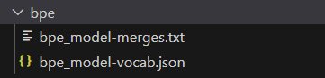
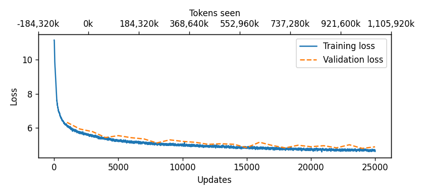
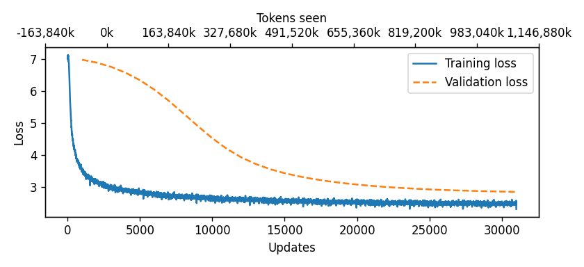
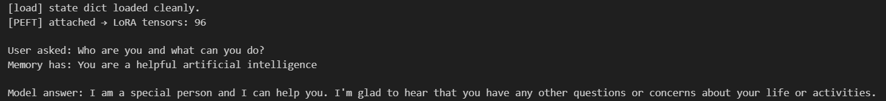
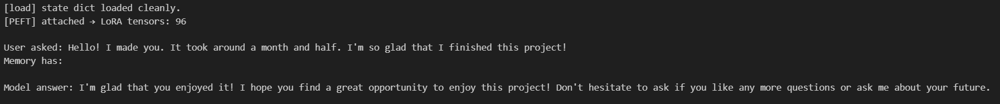
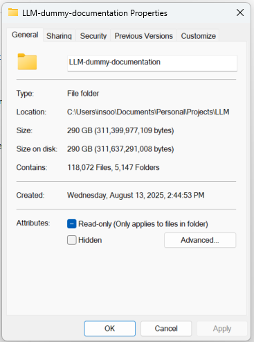

# Long Language Model (From Scratch)

Long Language Model from SCRATCH!!  
The idea of this project is to build LLM from scratch; better understand the overall algorithm and knowledge on how LLM works in details.  
Same as how ChatGPT, Grok, Llama, etc., you ask a question (with some information) and the AI model will answer the question.

# Disclaimer
This is a small model with ~130M parameters.  
The quality of the output is not that good.  
Obviously with larger parameters and datasets, it will respond with better quality.  
But since I've done this in my laptop, to make it managable, i decided to work with small model.  
(also tried to make 300M model, but it was reporting few months for only pretraining...)

# Goal
Since it is a small model, the goal of our AI is to to output **"at least understandable"** and **"somewhat answers the user's question"**

# Installation
Just download this project.  
The project itself contains installation guide.

# Brief Contents
## 1. Making tokenizer
After this phase, it will create following files:   

## 2. Preparing datasets for Pretraining
Building datasets for pretraining.  
- This uses 75000+ Gutenburg books
- We will perform concatination/cleanup/tokenization in this step

## 3. Making model&dataset pipeline
In this phase, we will create 3 files (note that those are in python_files folder of this project)
- `Dummy_Model.py`
- `npy_datasets.py`
- `train.py`

Other things, such as MultiHeadAttention, Cosine decay, etc. are covered here

## 4. Full pretraining
We will run pretraining.  
Below is the final graph for pretraining.  

## 5. Preparing datasets for Supervised Fine Tuning
In this phase, we will use datasets from 11 libraries SFT training.
- 10 libraries from hugging face
    - installation guide is covered in `8_Supervised_finetuning_Data_Schema/0_before_we_start.ipynb`
- 1 from release (I made that)
## 6. Supervised Fine Tuning training
W will run SFT training.  
Below is the final graph for finetuning.   

## 7. Sampling
With configuration&cleanup, we'll test out the trained model.  
Below are the examples of output.  
 

# **Warning**
In case you're testing full (like running all the way down)  
The size of this project is **290GB**   
  
Also, depends on system specifications, but with my current system:   
ASUS Zephyrus G15 (Laptop)
- OS: Windows 11 Home 64-bit
- CPU: AMD Ryzen 9 5900HS (16 CPUs), ~3.3GHz (also overclocked this to avg frequency 4.03GHz)
- GPU: NVIDIA GeForce RTX 3080 Laptop GPU 8GB VRAM
- RAM: 40GB

It took roughly a week.

# Reference
- https://link.springer.com/article/10.1007/s10462-024-10832-0
- https://scholar.google.com/scholar?hl=en&as_sdt=0%2C5&q=chatgpt&oq=chat
- https://github.com/rasbt/LLMs-from-scratch
- https://www.kaggle.com/datasets/lokeshparab/gutenberg-books-and-metadata-2025
- https://huggingface.co/
- bunch of videos related to LLM architecture from YouTube...